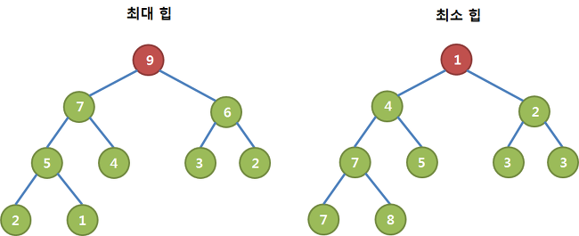

# 자료구조 TREE
## 우선순위 큐
* 일반적으로 큐는 먼저 들어오는 데이터가 먼저 나가는 FIFO 형식의 자료구조이다.  
**우선순위 큐**는 먼저 들어오는 데이터가 아니라, 우선순위가 높은 데이터가 먼저 나가는 형식의 자료구조이다. 
* 우선순위 큐는 일반적으로 힙(Heap)을 이용하여 구현한다. 

> **최소 우선순위 큐**
>* 최소 우선순위 큐는 가장 낮은 우선순위를 가진 요소가 먼저 나오는 큐이다.
>* 주로 최단 경로 알고리즘인 **다익스트라 알고리즘**에서 활용된다. 

> **최대 우선순위 큐**
>* 최대 우선순위 큐는 가장 높은 우선순위를 가진 요소가 먼저 나오는 큐이다.
>* 주로 힙(Heap) 자료구조를 사용하여 구현되며, 작업 스케줄링이나 최댓값을 찾아야 하는 상황에서 사용된다. 

## 힙 (Heap)
* 데이터에서 최댓값과 최솟값을 빠르게 찾기 위해 고안된 완전 이진 트리이다. 
* 최솟값이나 최댓값을 찾기 위해 배열을 사용할 경우 O(n)만큼 시간이 걸린다. 힙을 사용하면 **O(logn)** 만큼 소요되므로, 배열보다 빠르게 최솟값과 최댓값을 구할 수 있다. 
* 최대힙 (Max heap)과 최소힙 (Min heap)으로 나뉜다.
> **최대 힙 (Max heap)**  
>* 부모 노드의 키 값이 자식 노드의 키 값보다 크거나 같은 완전 이진 트리 이다. 
>* 부모 노드 key >= 자식 노드 key

> **최소 힙 (Min heap)**  
>* 부모 노드의 키 값이 자식 노드의 키 값보다 작거나 작은 완전 이진 트리 이다.
>* 부모 노드 key <= 자식 노드 key 

## 이진 탐색 트리 (Binary Search Tree)

* 이진 탐색 트리의 정의  
> 1. 모든 원소의 키는 유일한 키를 가진다. (중복된 값은 못가진다.)
> 2. 왼쪽 서브 트리 키들은 루트 키보다 작다.
> 3. 오른쪽 서브 트리의 키들은 루트의 키보다 크다.
> 4. 왼쪽, 오른쪽 서브 트리 모두 이진 탐색 트리이다.
> 5. *이진 탐색 트리를 중위 순회 방법(inorder)으로 순회하면 오름차순으로 출력할 수 있다.*

